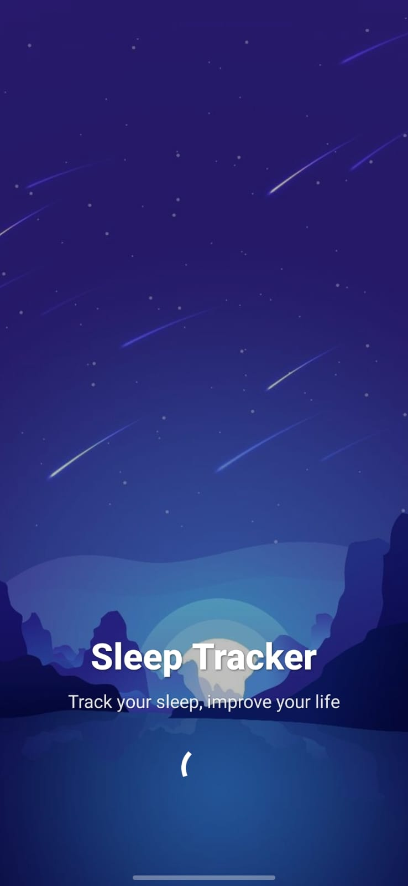
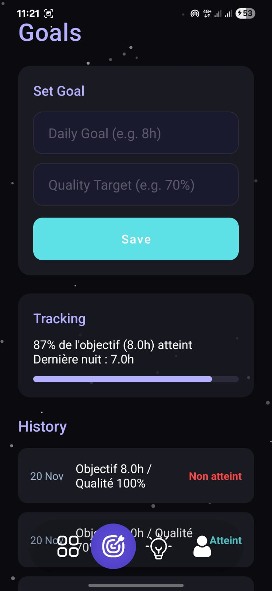
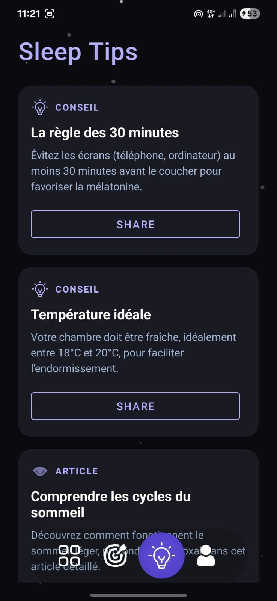

# 🌙 Sleep Tracker App

  
  
  
  

---

## 📖 Table of Contents
- [✨ Features](#-features)
- [📱 App Screenshots](#-app-screenshots)
- [🛠️ Tech Stack](#-tech-stack)
- [🚀 Getting Started](#-getting-started)
- [📂 Project Structure](#-project-structure)
- [🤝 How to Contribute](#-how-to-contribute)
- [📫 Author](#-author)

---

## ✨ Features

| Feature | Description |
| :--- | :--- |
| **📊 Smart Dashboard** | Interactive charts with sleep stats & weather info. |
| **🛌 Auto Sleep Tracking** | Detects movement via sensors & calculates sleep quality. |
| **📝 Manual Logging** | Add sleep data manually with ratings. |
| **🎯 Goal Setting** | Track your sleep goals with visual progress bars. |
| **💡 Sleep Tips** | Curated articles and videos to improve your sleep hygiene. |
| **☁️ Cloud Sync** | Firebase Auth & Firestore keep your data safe and synced. |
| **🎨 Dynamic UI** | Smooth animations, gradients, and starry night theme. |

---

## 📱 App Screenshots

  <table>
    <tr>
      <td align="center"><b>Splash</b> Auto Sensor & Timer</td>
      <td align="center"><b>Dashboard</b> View Stats & Weather</td>
    </tr>
    <tr>
      <td></td>
      <td></td>
    </tr>
    <tr>
      <td align="center"><b>Goals</b> Set Targets & History</td>
      <td align="center"><b>Tips</b> Learn Better Habits</td>
    </tr>
    <tr>
      <td></td>
      <td></td>
    </tr>
  </table>

---

## 🛠️ Tech Stack

* **Language:** [Kotlin](https://kotlinlang.org/) (JVM Toolchain 21)
* **Architecture:** MVVM (Model-View-ViewModel)
* **Backend:**
    * [Firebase Auth](https://firebase.google.com/docs/auth) (Login/Register)
    * [Firebase Firestore](https://firebase.google.com/docs/firestore) (NoSQL Database)
* **Network:** [Retrofit](https://square.github.io/retrofit/) & Gson
* **UI/UX:** MPAndroidChart, Lottie Animations, Material Components
* **Hardware:** Accelerometer sensors (`SensorManager`) & location (`FusedLocationProviderClient`)

---

> **Sleep better. Live better.**  
> Built with ❤️ by **Aymen Zemrani**.  
> A modern Android application built with **Kotlin** & **Firebase** to help track your sleep, improve your sleep hygiene, and wake up refreshed.
